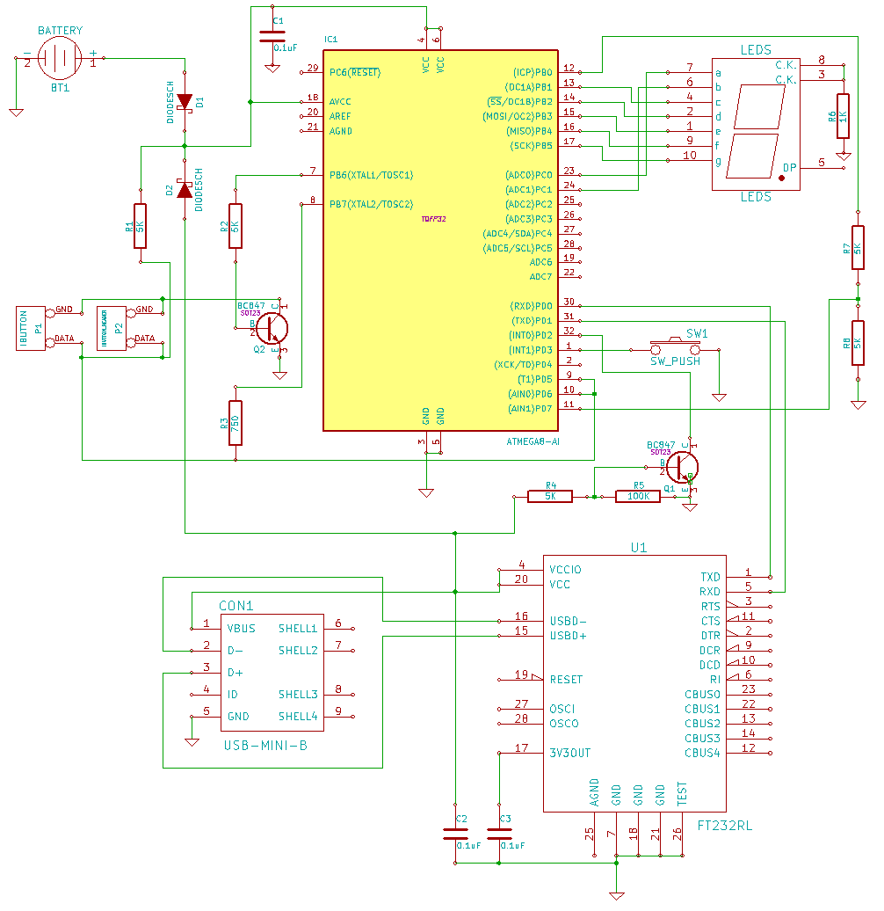
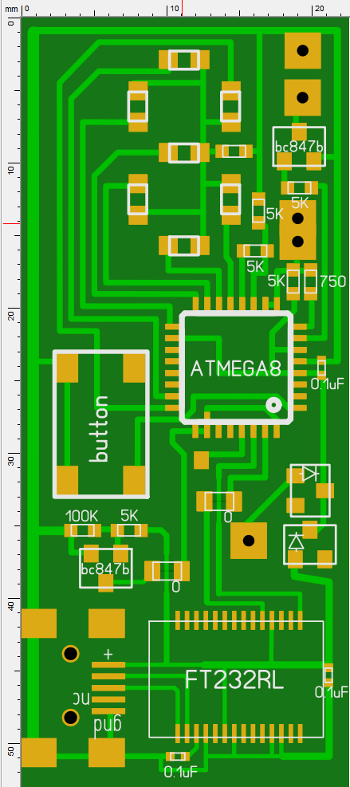

Эмулятор домофонных ключей iButton/Cyfral/Metacom
=================================================

Устроство способно считывать домофонные ключи iButton/Cyfral и имитировать ключи iButton/Cyfral/Metacom для открытия домофонов. Таким образом, можно в одном брелке носить ключи сразу от многих дверей. Есть возможность подключить устройство по USB к компьютеру.

Схема
-----

Компоненты и их предназначение:
* **IC1** - микроконтроллер ATMEGA8/ATMEGA8A/ATMEGA8L;
* **U1** - USB-контроллер FT232RL, нужен для подключения устройства к компьютеру;
* **CON1** - miniUSB разъём;
* **BT1** - батарейки, дающие 5 вольт;
* **D1** и **D2** - диоды (желательно шоттки), которые изолируют питание от батареи от питания от USB;
* **P1** - "таблетка" iButton, используется для подключения к домофонам;
* **P2** - контакты считывателя ключей, используются для подключения к ключам;
* **R1** - резистор, подтягивающий линию 1-wire к VCC;
* **R2** - токопонижающий резистор для управления транзистором **Q2**;
* **R3** - резистор, ещё сильнее подтягивающий линию к VCC для считывания ключей Cyfral;
* **R4** - токопонижающий резистор, используется для открытия **Q1** и определения подключения к USB;
* **R5** - подтягивает базу **Q1** к земле, чтобы закрывать его, когда нет подключения к USB;
* **R6** - токопонижающий резистор для светодиодов, достаточно одного, т.к. одновременно они не горят;
* **R7** и **R8** - делитель напряжения для одного из входов компаратора, чтобы считывать ключи Cyfral;
* **Q1** - транзистор для определения подключения к USB;
* **Q2** - транзистор для включения земли на считывателе и эмуляторе, чтобы не сажать батарейки, случайно замкнув контакты в кармане;
* **C1**, **C2** и **C3** - конденсаторы для фильтрации питания;
* **SW1** - единственная кнопка для управления устройством;
* **LEDS** - семь светодиодов в форме восьмёрочки для отображения номера ключа.

Вариант печатной платы:

Использование
-------------

Управление производится всего одной кнопкой. При её первом нажатии устройство включается. Кратковременным нажатием кнопки производится выбор ключа, номер которого отображается светодиодами. Когда нужный ключ выбран, достаточно приложить контакты к считывателю домофона.

Длительное нажатие на кнопку переводит устройство в режим считывания ключей, при этом мигает средний светодиод. В этот момент нужно приложить ключ к контактам считывателя ключей. Если считывание прошло успешно, отобразится номер, под которым ключ занесён в память.

Если устройство было включено длительным нажатием кнопки, оно отобразит цифру "0", это означает, что включен режим "вездехода", используя не прочитанные заранее ключи, а несколько общеизвестных универсальных кодов, которые работают с некоторыми домофонами.

Подключение по USB
------------------
Для синхронизации с компьютером используется USB. Клиент скоро будет.
